# Modul 2 (CRUD MongoDB)

Nama: Irfan Hanif Habibi  
NIM: 215150701111025

## MongoDB Compass

Penyambungan koneksi ke MongoDB menggunakan connection string.
> 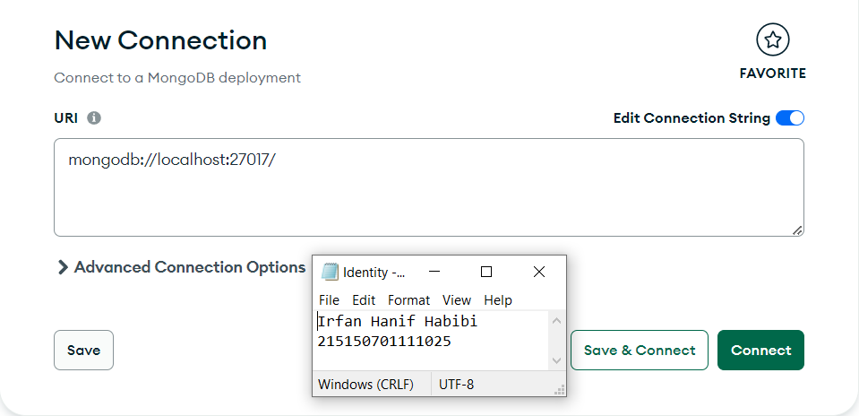

Pembuatan database "bookstore" dengan collection "books".
> 

Menambahkan data buku dengan operasi insert dokumen.
> 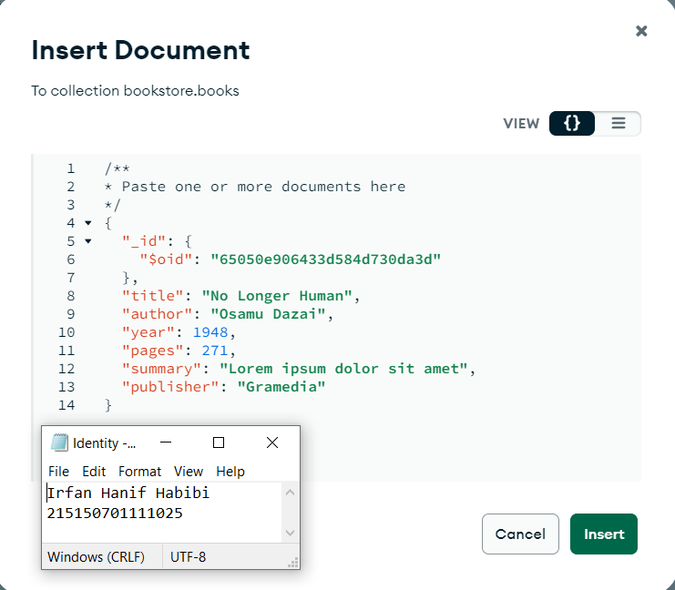

Menambahkan data buku kedua dengan operasi insert dokumen yang sama.
> 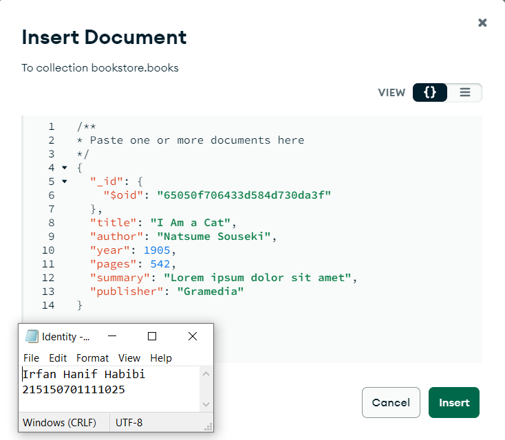

Melakukan pencarian buku dengan author "Osamu Dazai".
> 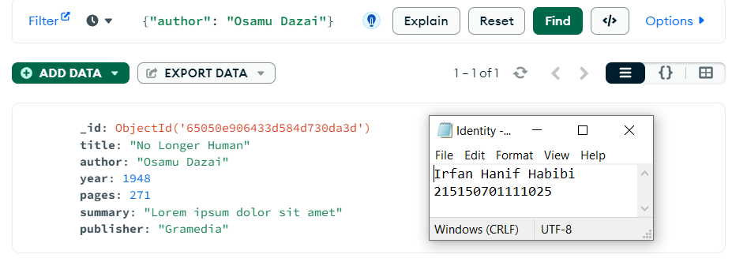

Mengubah properti "summary" pada buku "No Longer Human" dengan melakukan operasi update dokumen.
> 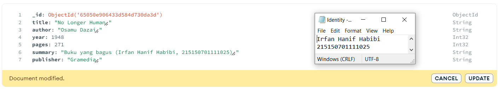

Menghapus buku "I Am a Cat" dengan melakukan operasi delete dokumen.
> 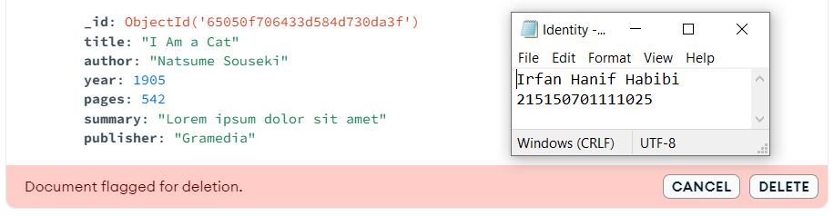

## MongoDB Shell

Penyambungan koneksi ke MongoDB Server dengan menggunakan perintah `mongosh` dalam CMD.
> 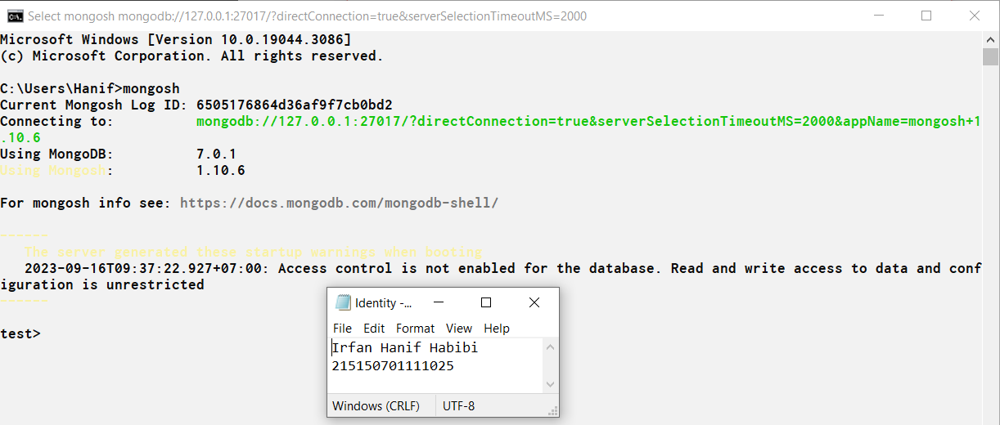

Pengecekan daftar database dalam server mongoDB dengan perintah `show dbs`.
> 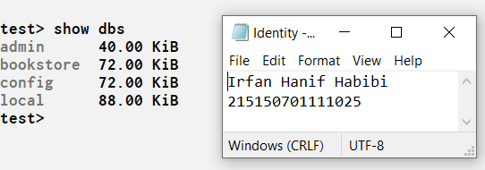

Pindahkan terminal ke dalam database `bookstore` dengan perintah `use bookstore`.
> 

Mengecek daftar collection yang ada dalam database dengan perintah `show collections` .
> 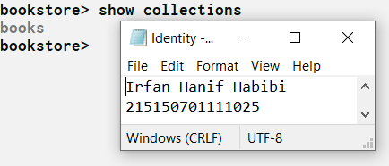

Menambahkan buku "Overlord I" ke dalam collection `books` dengan perintah `db.books.insertOne(<data>)`.
> 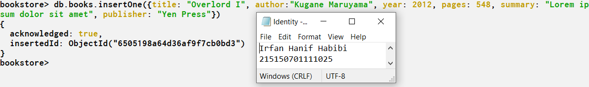

Menambahkan buku "The Setting Sun" dan "Hujan" ke dalam collection `books` dengan perintah `db.books.insertMany(<data>)`.
> 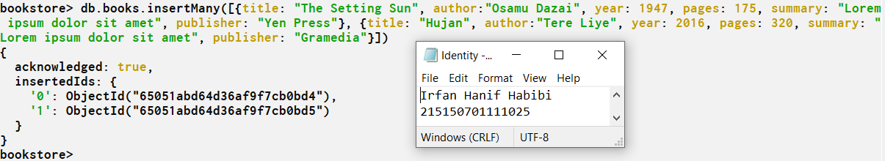

Pencarian semua buku dalam collection `books` dengan perintah `db.books.find()`.
> 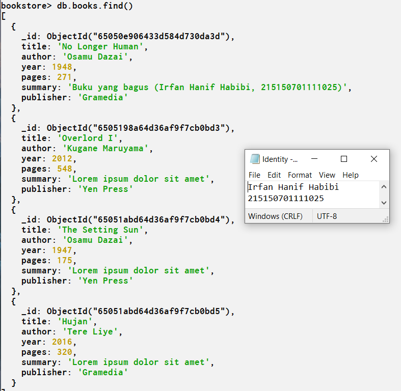

Pencarian buku dengan author "Osamu Dazai" dalam collection `books` dengan perintah `db.books.find(<filter>)`.
> 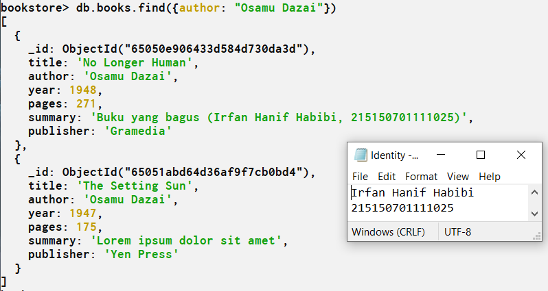

Melakukan perubahan properti `summary` pada buku "Hujan" dalam collection `books` dengan perintah `db.books.UpdateOne(<filter>, {$set: {<data>}})`.
> 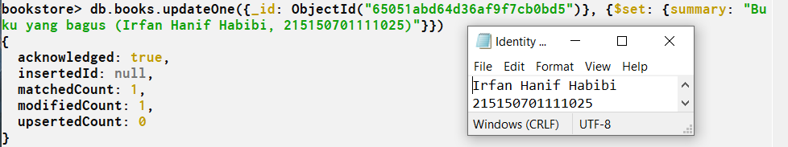

Melakukan perubahan properti `publisher` pada buku-buku dengan author "Osamu Dazai" dalam collection `books` dengan perintah `db.books.UpdateMany(<filter>, {$set: {<data>}})`.
> 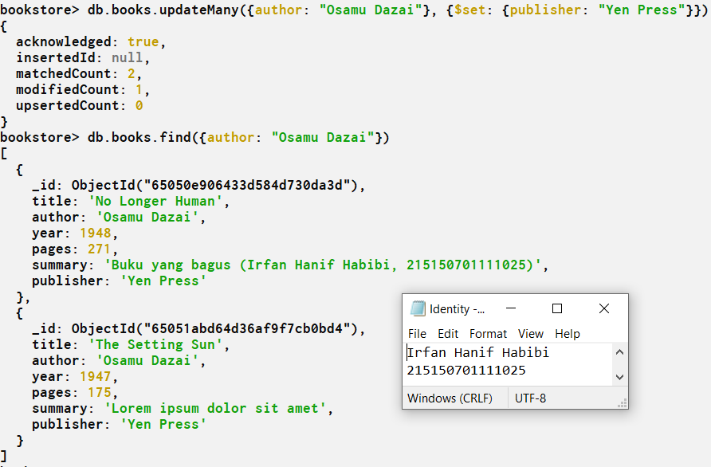

Penghapusan buku berjudul "Overlord I" dalam collection `books` dengan perintah `db.books.deleteOne(<argumen>)`.
> 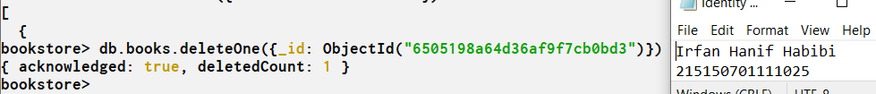

Penghapusan buku dengan author "Osamu Dazai" dalam collection `books` dengan perintah `db.books.deleteMany(<argumen>)`.
> 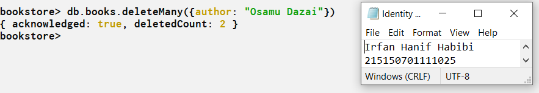
