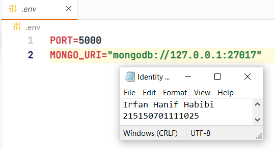

# Modul 3 (Integrasi MongoDB dan Express)

Nama: Irfan Hanif Habibi <br>
NIM: 215150701111025

## Percobaan instalasi NodeJS

*Saya telah menginstal node.js sebelumnya*
Menjalankan command node -v untuk memeriksa apakah NodeJS sudah terinstall
> 

## Inisiasi project Express dan pemasangan package

Pembuatan folder dengan nama express-mongodb.
> 

Men-generate file package.json dengan menggunakan command `npm init -y`.
> 

Lakukan instalasi express, mongoose, dan dotenv dengan menggunakan command `npm i express mongoose dotenv`.
> 

## Koneksi Express ke MongoDB

Pembuatan file index.js pada root folder dan masukkan kode:
```
require('dotenv').config();
const express = require('express');
const mongoose = require('mongoose');

const app = express();

app.use(express.json());

app.get('/', (req, res) => {
	res.status(200).json({
		message: '<nama>,<nim>'
	})
})

const PORT = 8000;
app.listen(PORT, () => {
	console.log(`Running on port ${PORT}`);
})
```
> 

Menjalankan aplikasi node.js dengan command `node index.js`.
> 
> 

Pembuatan file `.env` dengan memasukkan kode berisi *variable environment* berikut:
```
PORT=5000
```
> 

Mengubah kode pada listening port menjadi sesuai di bawah dan coba jalankan aplikasi node.js kembali.
```
...
const PORT = process.env.PORT || 8000;
app.listen(PORT, () => {
	console.log(`Running on port ${PORT}`);
})
```
> 
> 
*Port yang digunakan adalah merupakan variable environment yang berada di file `.env` *

Copy connection string yang terdapat pada compas atau atlas dan paste kan pada `.env` seperti berikut:
```
MONGO_URI="mongodb://127.0.0.1:27017"
```
> 

Tambahkan baris kode berikut pada file index.js:
```
require("dotenv").config();
const express = require("express");
const mongoose = require("mongoose");

mongoose.connect(process.env.MONGO_URI);
const db = mongoose.connection;

db.on("error", (error) => {
  console.log(error);
});
  
db.once("connected", () => {
  console.log("Mongo connected");
});

...
```
> 

Setelah itu coba jalankan aplikasi kembali.
> 

## Pembuatan routing

Pembuatan direktori `routes` di tingkat yang sama dengan index.js.
> 

Membuat file `book.route.js` di dalam direktori `routes`.
> 

Penambahan baris kode berikut untuk fungsi `getAllBooks`:
```
const router = require("express").Router();

router.get("/", function getAllBooks(req, res) {
  res.status(200).json({
    message: "mendapatkan semua buku",
  });
});

module.exports = router;
```
> 

Penambahan baris kode berikut untuk fungsi `getOneBook`, `createBook`, `updateBook`, dan `deleteBook`:
```
const router = require("express").Router();

...  

router.get("/:id", function getOneBook(req, res) {
  const id = req.params.id;
  res.status(200).json({
    message: "mendapatkan satu buku",
    id,
  });
});

router.post("/", function createBook(req, res) {
  res.status(200).json({
    message: "membuat buku baru",
  });
});

router.put("/:id", function updateBook(req, res) {
  const id = req.params.id;
  res.status(200).json({
    message: "memperbaharui satu buku",
    id,
  });
});

router.delete("/:id", function deleteBook(req, res) {
  const id = req.params.id;
  res.status(200).json({
    message: "menghapus satu buku",
    id,
  });
});

module.exports = router;
```
> 

Penambahan baris kode berikut untuk import `book.route.js` pada file `index.js`:
``` 
require("dotenv").config();
const express = require("express");
const mongoose = require("mongoose");
const bookRoutes = require("./routes/book.route"); //

...  

app.get("/", (req, res) => {
  res.status(200).json({
    message: "<nama>,<nim>",
  });
});

app.use("/books", bookRoutes); //

const PORT = process.env.PORT || 8000;
app.listen(PORT, () => {
  console.log(`Running on port ${PORT}`);
});
```
> 

Pengujian kembali salah satu endpoint dengan Postman.
> 

## Pembuatan controller

Pembuatan direktori `controllers` di tingkat yang sama dengan index.js.
> 

Membuat file `book.controller.js` di dalam direktori `controllers`.
> 

Penambahan baris kode yang merupakan salinan dari `book.route.js` berikut untuk fungsi `getAllBooks`:
```
function getAllBooks(req, res) {
  res.status(200).json({
    message: "mendapatkan semua buku",
  });
}

module.exports = {
  getAllBooks,
};
```
> 

Penambahan baris kode berikut yang merupakan salinan dari `book.route.js` untuk fungsi `getOneBook`, `createBook`, `updateBook`, dan `deleteBook`:
```
...

function getOneBook(req, res) {
  const id = req.params.id;
  res.status(200).json({
    message: "mendapatkan satu buku",
    id,
  });
}

function createBook(req, res) {
  res.status(200).json({
    message: "membuat buku baru",
  });
}

function updateBook(req, res) {
  const id = req.params.id;
  res.status(200).json({
    message: "memperbaharui satu buku",
    id,
  });
}

function deleteBook(req, res) {
  const id = req.params.id;
  res.status(200).json({
    message: "menghapus satu buku",
    id,
  });
}

module.exports = {
  getAllBooks,
  getOneBook, //
  createBook, //
  updateBook, //
  deleteBook, //
};
```
> 
> 

Penambahan baris kode berikut untuk import `book.controller.js` pada file `book.route.js`:
``` 
const router = require('express').Router();
const book = require('../controllers/book.controller'); //
...
module.exports = router;
```
> 

Pengubahan baris kode berikut untuk import fungsi-fungsi dari `book.controller.js` pada file `book.route.js`:
``` 
const router = require("express").Router();
const book = require("../controllers/book.controller");

router.get("/", book.getAllBooks);
router.get("/:id", book.getOneBook);
router.post("/", book.createBook);
router.put("/:id", book.updateBook);
router.delete("/:id", book.deleteBook);

module.exports = router;
```
> 

Pengujian kembali salah satu endpoint dengan Postman.
> 

## Pembuatan model

Pembuatan direktori `models` di tingkat yang sama dengan index.js.
> 

Membuat file `book.model.js` di dalam direktori `models`.
> 

Penambahan baris kode yang merupakan implementasi skema dalam model `book`:
```
const mongoose = require("mongoose");
const bookSchema = new mongoose.Schema({
  title: {
    type: String,
  },
  author: {
    type: String,
  },
  year: {
    type: Number,
  },
  pages: {
    type: Number,
  },
  summary: {
    type: String,
  },
  publisher: {
    type: String,
  },
});

module.exports = mongoose.model("book", bookSchema);
```
> 

## Operasi CRUD

Hapus semua data pada collection books.
> 

Penambahan kode untuk melakukan import `book.model.js` pada file `book.controller.js`:
```
const Book = require('../models/book.model');
...
```
> 

Pengubahan kode untuk melakukan perubahan fungsi `createBook` pada file `book.controller.js`:
```
const Book = require("../models/book.model");

...

async function createBook(req, res) {
  const book = new Book({
    title: req.body.title,
    author: req.body.author,
    year: req.body.year,
    pages: req.body.pages,
    summary: req.body.summary,
    publisher: req.body.publisher,
  });
  try {
    const savedBook = await book.save();
    res.status(200).json({
      message: "membuat buku baru",
      book: savedBook,
    });
  } catch (error) {
    res.status(500).json({
      message: "kesalahan pada server",
      error: error.message,
    });
  }
}

...
```
> 

Pembuatan dua buah buku dengan data di bawah ini dengan Postman.
```
{
"title": "Dilan 1990",
"author": "Pidi Baiq",
"year": 2014,
"pages": 332,
"summary": "Mirea, anata wa utsukushī",
"publisher": "Pastel Books"
}
```
> 

```
{
"title": "Dilan 1991",
"author": "Pidi Baiq",
"year": 2015,
"pages": 344,
"summary": "Watashi ga kare o aishite iru to ittara",
"publisher": "Pastel Books"
}
```
> 

Pengubahan kode untuk melakukan perubahan fungsi `getAllBooks` pada file `book.controller.js`
```
const Book = require("../models/book.model");

async function getAllBooks(req, res) {
  try {
    const books = await Book.find();
    res.status(200).json({
      message: "mendapatkan semua buku",
      books,
    });
  } catch (error) {
    res.status(500).json({
      message: "kesalahan pada server",
      error: error.message,
    });
  }
}

...
```
> 

Pengubahan kode untuk melakukan perubahan fungsi `getOneBook` pada file `book.controller.js`
```
const Book = require("../models/book.model");

...

async function getOneBook(req, res) {
  const id = req.params.id;
  try {
    const book = await Book.findById(id);
    res.status(200).json({
      message: "mendapatkan satu buku",
      book,
    });
  } catch (error) {
    res.status(500).json({
      message: "kesalahan pada server",
      error: error.message,
    });
  }
  
...
```
> 

Menampilkan semua buku dengan Postman.
> 

Menampilkan buku Dilan 1990 dengan Postman.
> 

Pengubahan kode untuk melakukan perubahan fungsi `updateBook` pada file `book.controller.js`
```
const Book = require("../models/book.model");

...

async function updateBook(req, res) {
  const id = req.params.id;
  try {
    const book = await Book.findByIdAndUpdate(id, req.body, { new: true });
    res.status(200).json({
      message: "memperbaharui satu buku",
      book,
    });
  } catch (error) {
    res.status(500).json({
      message: "kesalahan pada server",
      error: error.message,
    });
  }
}
  
...
```
> 

Mengubah buku Dilan 1991 menjadi "Hanif 1991" dengan Postman.
> 

Pengubahan kode untuk melakukan perubahan fungsi `deleteBook` pada file `book.controller.js`
```
const Book = require("../models/book.model");

...

async function deleteBook(req, res) {
  const id = req.params.id;
  try {
    const book = await Book.findByIdAndDelete(id);
    res.status(200).json({
      message: "menghapus satu buku",
      book,
    });
  } catch (error) {
    res.status(500).json({
      message: "kesalahan pada server",
      error: error.message,
    });
  }
}
  
...
```
> 

Menghapus buku Dilan 1990 dengan Postman.
> 
