# Modul 4 (Basic Routing & Migration)

Nama: Irfan Hanif Habibi <br>
NIM: 215150701111025

## Basic Routing

### GET
Menambahkan endpoint dengan method GET pada aplikasi dengan menambahkan baris berikut pada file `web.php`:
```
$router->get('/get', function() {
    return 'GET';
});
```
> 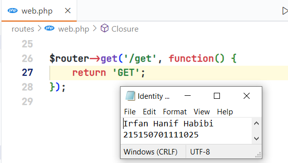

Pengaksesan endpoint yang telah dibuat dengan menggunakan browser.
> 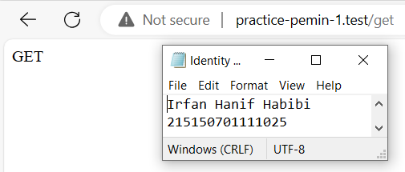

### POST, PUT, PATCH, DELETE, dan OPTIONS
Menambahkan endpoint-endpoint lain dengan method POST, PUT, PATCH, DELETE, dan OPTIONS pada aplikasi dengan menambahkan baris berikut pada file `web.php`:
```
$router->post('/post', function () {
    return 'POST';
});

$router->put('/put', function () {
    return 'PUT';
});

$router->patch('/patch', function () {
    return 'PATCH';
});

$router->delete('/delete', function () {
    return 'DELETE';
});

$router->options('/options', function () {
    return 'OPTIONS';
});
```
> 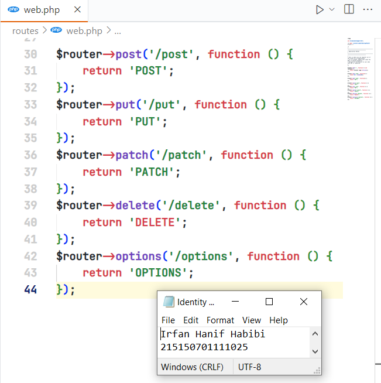

### Instal Ektensi Thunder Client pada VS Code
Penginstalan ekstensi dengan membuka panel extensions lalu mencari Thunder Client dan logonya akan ditampilkan pada activity bar VS Code.
> 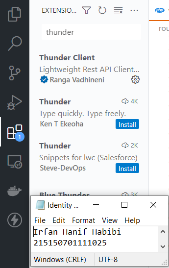

Pembuatan request baru dengan menekan "New Request" pada ekstensi dan memasukkan method dan URL API yang ingin kita tes.
> 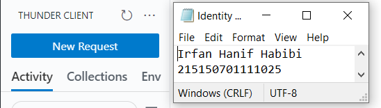
> 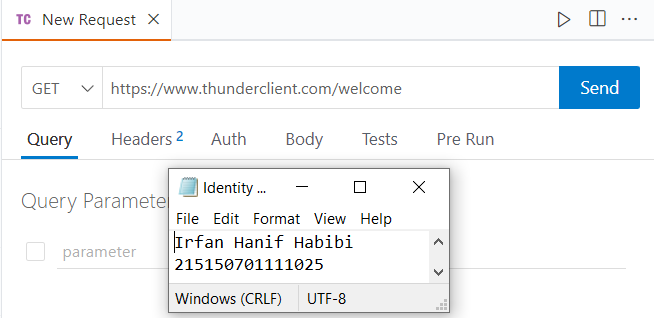

Pengaksesan beberapa URL dan method yang telah kita buat sebelumnya.
1. POST
	> 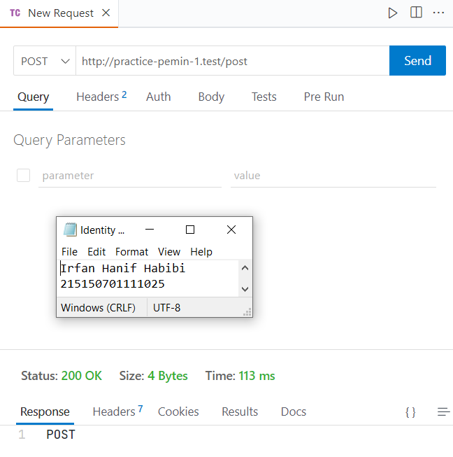
2. PUT
	> 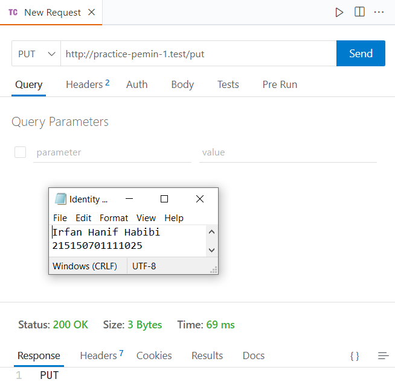
3. PATCH
	> 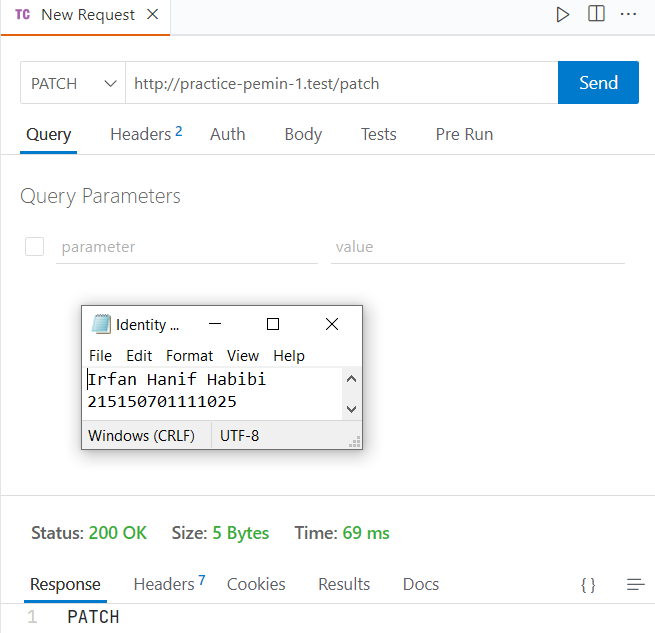
4. DELETE
	> 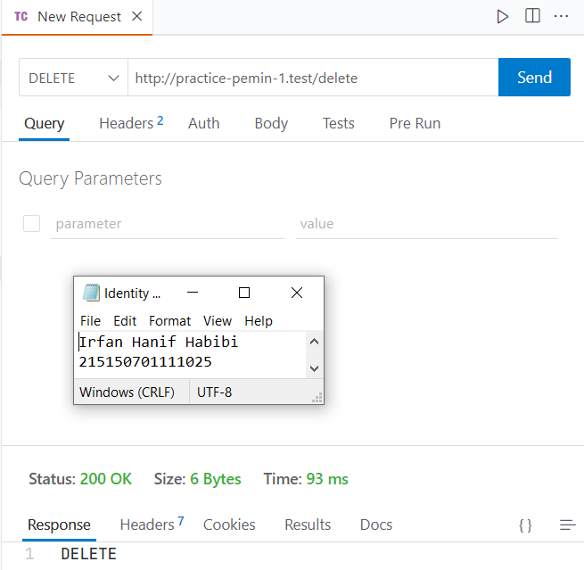
5. OPTIONS
	> 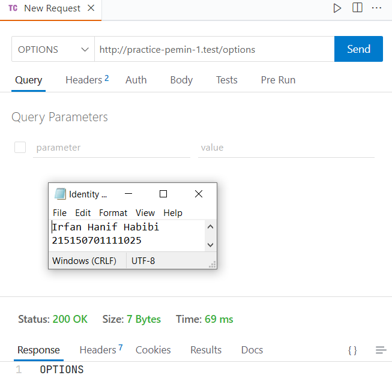
## Migrasi Database

Memastikan server database aktif kemudian sudah membuat database dengan nama `lumenapi`.
> 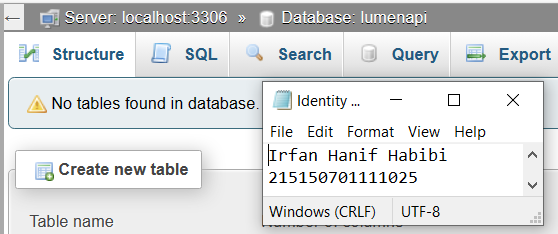

Mengubah beberapa konfigurasi database pada file .env menjadi seperti ini:
```
DB_CONNECTION=mysql
DB_HOST=127.0.0.1
DB_PORT=3306
DB_DATABASE=lumenapi
DB_USERNAME=root
DB_PASSWORD=
```
> 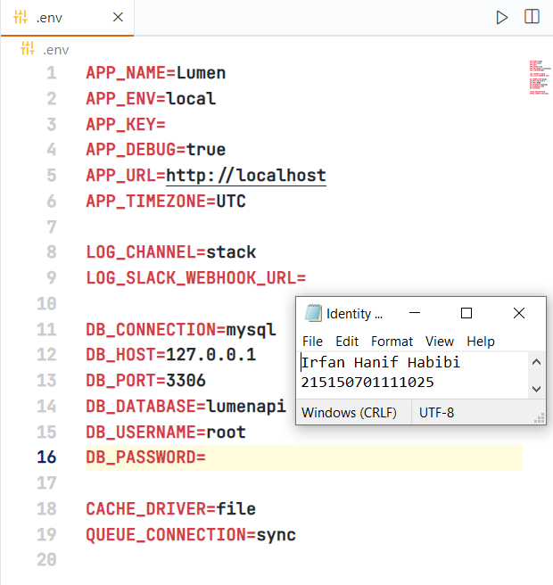

Menghidupkan kembali beberapa library bawaan dari lumen dengan membuka file app.php pada folder
bootstrap dan mengganti segmen kode menjadi berikut:
```
$app->withFacades();

$app->withEloquent();
```
> 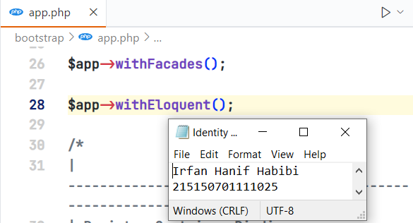

Menjalankan command berikut ini untuk pembuatan file migrasi:
```
php artisan make:migration create_users_table 
php artisan make:migration create_products_table
```
> 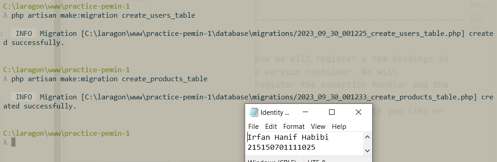

Mengubah fungsi `up` pada file migrasi `create_users_table` dengan kode berikut:
```
public function up(): void
    {
        Schema::create('users', function (Blueprint $table) {
            $table->id();
            $table->timestamps();
            $table->string('name');
            $table->string('email');
            $table->string('password');
        });
    }
```
> 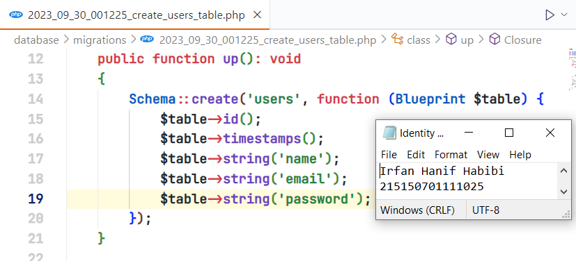

Mengubah fungsi `up` pada file migrasi `create_products_table` dengan kode berikut:
```
public function up(): void
    {
        Schema::create('products', function (Blueprint $table) {
            $table->id();
            $table->timestamps();
            $table->string('name');
            $table->integer('category_id');
            $table->string('slug');
            $table->integer('price');
            $table->integer('weight');
            $table->text('description');
        });
    }
```
> 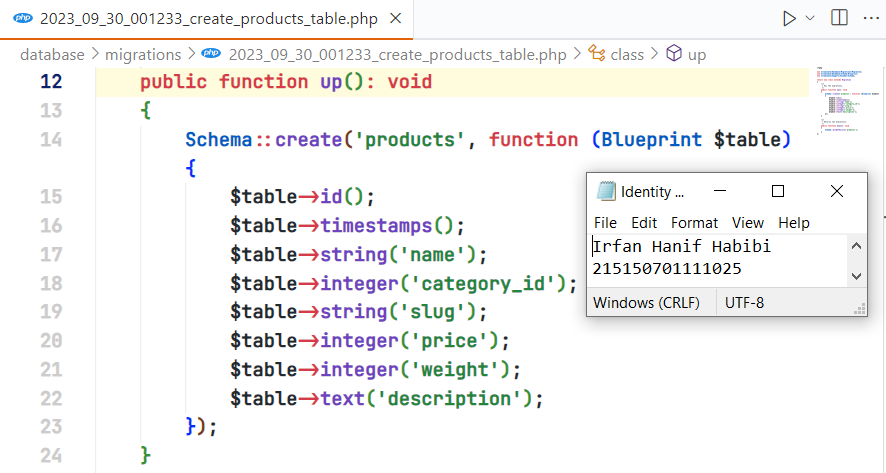

Menjalankan command berikut untuk melakukan migrasi database berdasarkan file migrasi `create_users_table.php` dan `create_products_table.php` yang telah dibuat sebelumnya:
```
php artisan migrate
```
> 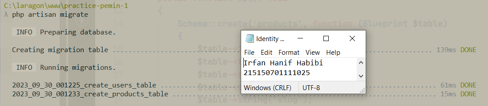
