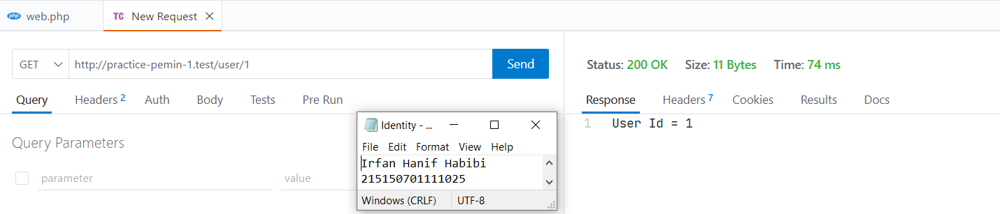
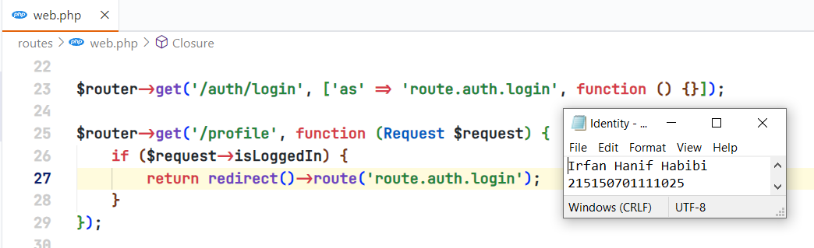
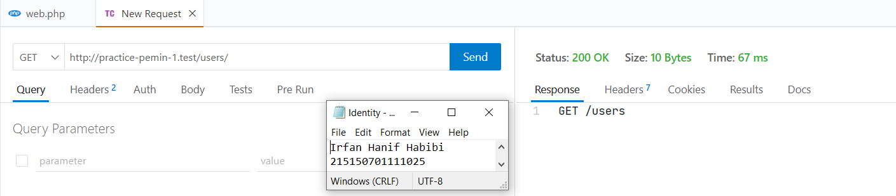

# Modul 5 (Dynamic Route & Middleware)

Nama: Irfan Hanif Habibi <br>
NIM: 215150701111025

## Dynamic Route

Menambahkan contoh dynamic route pada aplikasi lumen dengan menambahkan baris berikut pada file `web.php`:
```
$router->get('/user/{id}', function ($id) {
    return 'User Id = ' . $id;
});
```

Penambahan dynamic route dengan variabel lebih dari satu dapat dilakukan dengan kode berikut.
```
$router->get('/post/{postId}/comments/{commentId}', function ($postId, $commentId) {
    return 'Post ID = ' . $postId . ' Comments ID = ' . $commentId;
});
```
Pada dynamic route diatas terdapat dua variabel yaitu `postId` dan `commentId`.

Penambahan dynamic route dengan optional route, yang mana optional
routes tidak mengharuskan untuk memberi variable pada endpoint , namun saat pemanggilan endpoint, dapat menggunakan parameter variable ataupun tidak. Berikut adalah contoh kode dari dynamic route dengan optional route:
```
$router->get('/users[/{userId}]', function ($userId = null) {
    return $userId === null ? 'Data semua users' : 'Data user dengan id ' . $userId;
});
```
> 

Hasil Respon API menggunakan Thunder Client:
1. Dynamic Route
> 
2. Dynamic Route dengan lebih dari satu variabel
> 
3. Dynamic Route dengan optional route
> 
> 
## Aliases Route

Aliases route berfungsi untuk memberi nama pada route yang telah dibuat, sehingga dapat membantu saat ingin memanggil route tersebut pada aplikasi.
```
$router->get('/auth/login', ['as' => 'route.auth.login', function (...) {...}]);

$router->get('/profile', function (Request $request) {
    if ($request->isLoggedIn) {
        return redirect()->route('route.auth.login');
    }
});
```
> 

## Group Route
Penambahan route ke dalam group agar memudahkan penulisan route di dalam file `web.php`. Berikut adalah salah satu contoh kode grouping route:
```
$router->group(['prefix' => 'users'], function () use ($router) {
    $router->get('/', function () {
        return "GET /users";
    });
});
```
> 

Hasil Respon API menggunakan Thunder Client:
> 

## Middleware
Pembuatan middleware dengan menambahkan file pada folder `app/Http/Middleware` . Pada folder tersebut terdapat file `ExampleMiddleware` , kita dapat men-copy file tersebut untuk membuat middleware baru. Berikut adalah salah satu contoh yaitu `AppMiddleware`:
```
<?php
namespace App\Http\Middleware;
use Closure;
class AgeMiddleware

{
    /**
     * Handle an incoming request.
     *
     * @param \Illuminate\Http\Request $request
     * @param \Closure $next
     * @return mixed
     */
    public function handle($request, Closure $next)
    {
        if ($request->age < 17)
            return redirect('/fail');
        return $next($request);
    }
}
```
> 

Setelah menambahkan filter pada `AgeMiddleware` , maka harus mendaftarkan
`AgeMiddleware`pada aplikasi lumen pada file `bootstrap/app.php` seperti pada kode berikut:
```
...

// $app->middleware([
//     App\Http\Middleware\ExampleMiddleware::class
// ]);

$app->routeMiddleware([
    // 'auth' => App\Http\Middleware\Authenticate::class,
    'age' => App\Http\Middleware\AgeMiddleware::class
]);

...
```
> 

Terakhir. penambahan middleware pada route dengan menambahkan opsi middleware pada salah satu route. Berikut adalah contohnya:
```
...

$router->get('/admin/home/', ['middleware' => 'age', function () {
    return 'Dewasa';
}]);

$router->get('/fail', function () {
    return 'Dibawah umur';
});
```
> 
