# Modul 6 (Model, Controller, & Request Response)

Nama: Irfan Hanif Habibi <br>
NIM: 215150701111025

## Model

Memastikan tabel users ada dalam database `lumenapi`:
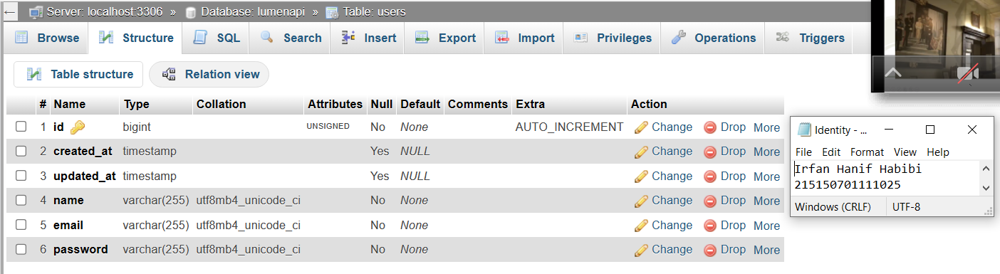

Mengubah kode dalam file `User.php` menjadi seperti berikut:
```
<?php
namespace App\Models;
  
use Illuminate\Database\Eloquent\Model;
  
class User extends Model
{
    /**
     * The attributes that are mass assignable.
     *
     * @var array
     */
    protected $fillable = [
        'name', 'email', 'password'
    ];
    /**
     * The attributes excluded from the model's JSON form.
     *
     * @var array
     */
    protected $hidden = [];
}
```
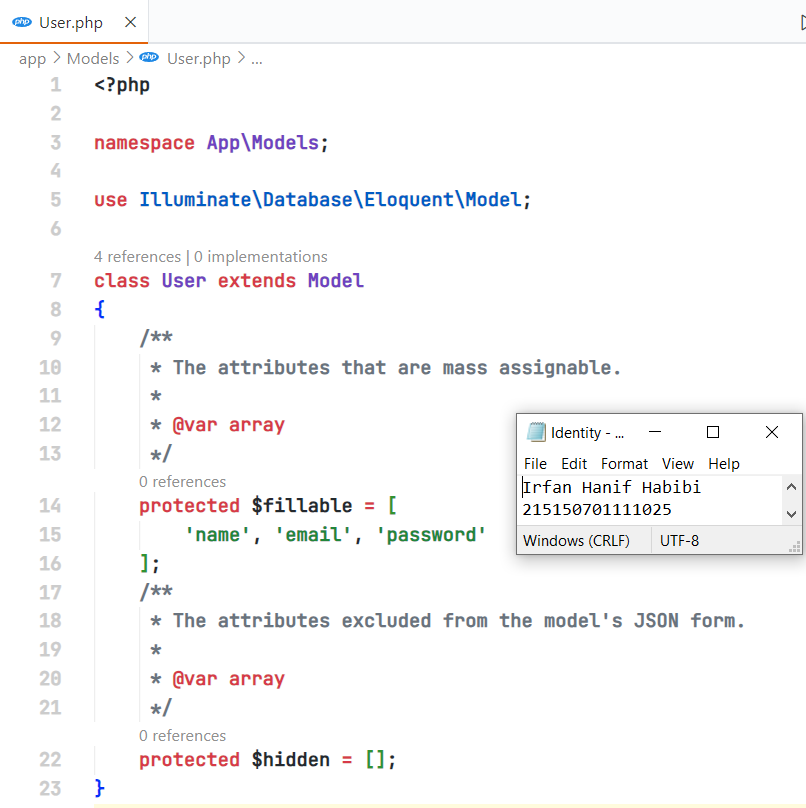

## Controller

Pembuatan file `HomeController.php` yang disalin dari `ExampleController.php` di `app/Http/Controllers` dengan mengubah kode didalamnya seperti berikut:
```
<?php

namespace App\Http\Controllers;

class HomeController extends Controller
{
    /**
    * Create a new controller instance.
    *
    * @return void
    */
    public function __construct()
    {
        //
    }
    
    public function index(Request $request)
    {
        return 'Hello, from lumen!';
    }
}
```
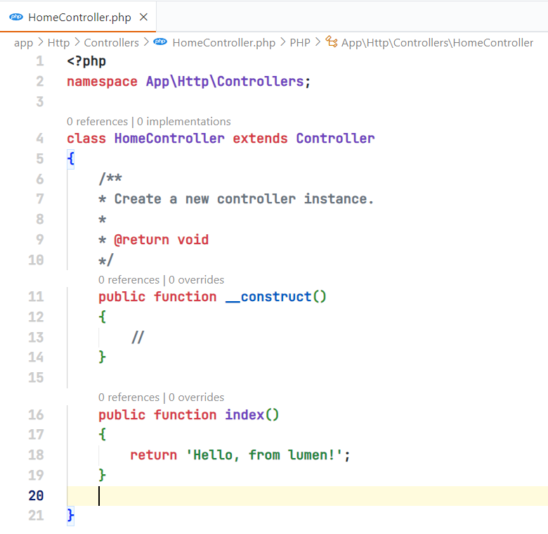

Setelah menambahkan `HomeController` dengan fungsi `index`, perlu dibuat route agar fungsi tersebut dapat diakses dengan menambahkan baris kode berikut ke dalam `web.php`:
```
...

$router->get('/', ['uses' => 'HomeController@index']);

...
```


Untuk mengetes fungsi dalam controller yang telah dibuat maka dapat menjalankan URL API dalam browser:
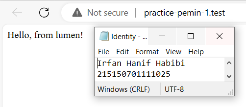

## Request Handler

Melakukan impor library Request, yang digunakan untuk mendapatkan obyek Request dari client, dengan menambahkan baris kode berikut:
```
use Illuminate\Http\Request;
```
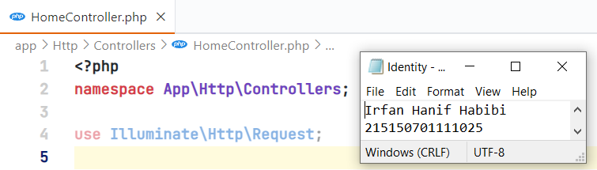

Pengubahan fungsi `index` dengan menggunakan obyek dari `Request` sebagai parameter.
```
<?php

namespace App\Http\Controllers;

class HomeController extends Controller
{
    /**
    * Create a new controller instance.
    *
    * @return void
    */
    public function __construct()
    {
        //
    }
    
    public function index(Request $request)
    {
        return 'Hello, from lumen! We got your request from endpoint: ' . $request->path();
    }
}
```
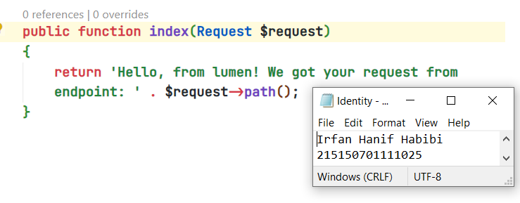

Menjalankan URL API dalam browser Untuk mengetes fungsi dalam controller.
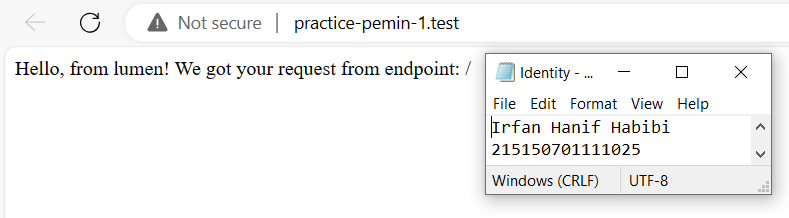

## Response Handler

Melakukan impor library Response, yang menghasilkan obyek Response yang dikirim dari server, dengan menambahkan baris kode berikut:
```
use Illuminate\Http\Response;
```
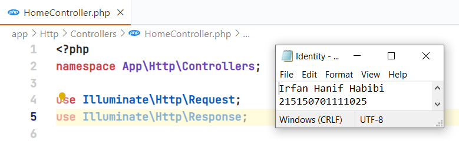

Membuat fungsi `hello` yang mengembalikan obyek `Response` kepada client dengan menambahkan baris kode berikut dalam `HomeController.php`:
```
public function hello()
    {
        $data['status'] = 'Success';
        $data['message'] = 'Hello, from lumen!';
        return (new Response($data, 201))
            ->header('Content-Type', 'application/json');
    }
```
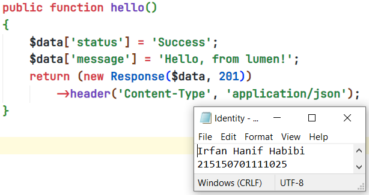

Menambahkan rute baru untuk fungsi `hello` yang telah dibuat dengan menambahkan baris kode ini dalam `web.php`:
```
$router->get('/hello', ['uses' => 'HomeController@hello']);
```
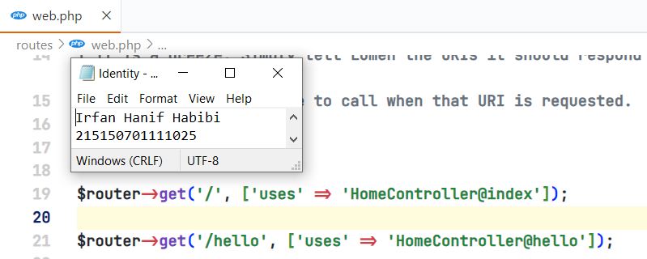

Untuk mengetes fungsi `hello` dalam controller yang telah dibuat maka dapat menjalankan URL API dalam browser:
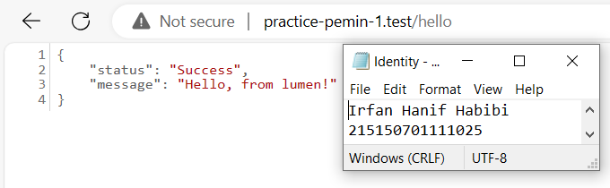

## Penerapan

Melakukan impor model User pada file `HomeController.php` dengan menambahkan baris kode berikut:
```
<?php

namespace App\Http\Controllers;

use App\Models\User;
use Illuminate\Http\Request;
use Illuminate\Http\Response;

...

```
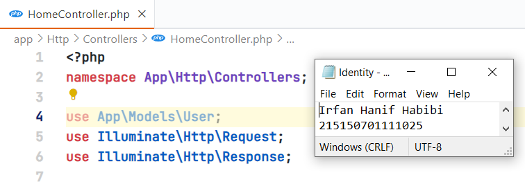

Penambahan fungsi berkaitan dengan model `User` di dalam `HomeController.php` dengan menambahankan kode berikut:
```
...

public function defaultUser()
    {
        $user = User::create([
                'name' => 'Nahida',
                'email' => 'nahida@akademiya.ac.id',
                'password' => 'smol'
                ]);

        return response()->json([
            'status' => 'Success',
            'message' => 'default user created',
            'data' => [
                'user' => $user,
            ]
        ], 200);
    }

    public function createUser(Request $request)
    {
        $name = $request->name;
        $email = $request->email;
        $password = $request->password;
        $user = User::create([
            'name' => $name,
            'email' => $email,
            'password' => $password
        ]);

        return response()->json([
            'status' => 'Success',
            'message' => 'new user created',
            'data' => [
                'user' => $user,
            ]
        ], 200);
    }

    public function getUsers()
    {
        $users = User::all();
        return response()->json([
            'status' => 'Success',
            'message' => 'all users grabbed',
            'data' => [
                'users' => $users,
            ]
        ], 200);
    }
    
...
```
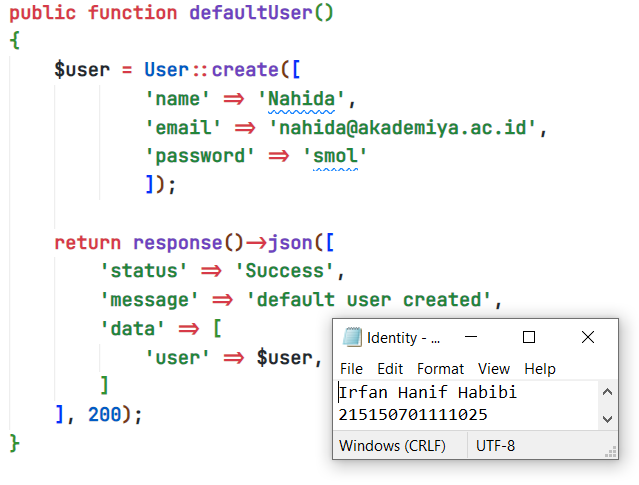
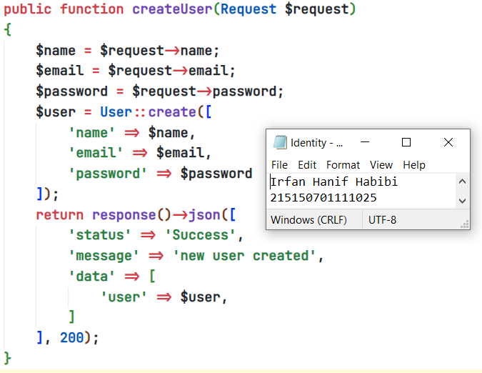
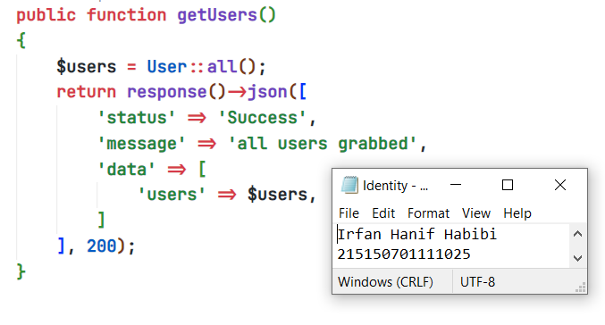

Setelah menambahkan fungsi-fungsi tersebut, perlu adanya rute-rute terbaru agar fungsi dapat diakses pada `web.php` dengan kode berikut:
```
...

$router->group(['prefix' => 'users'], function () use ($router) {
    $router->post('/default', ['uses' => 'HomeController@defaultUser']);
    $router->post('/new', ['uses' => 'HomeController@createUser']);
    $router->get('/all', ['uses' => 'HomeController@getUsers']);
});

...
```
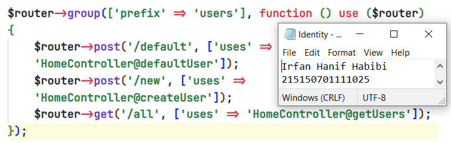

Menjalankan aplikasi lumen dengan rute `/users/default` pada postman
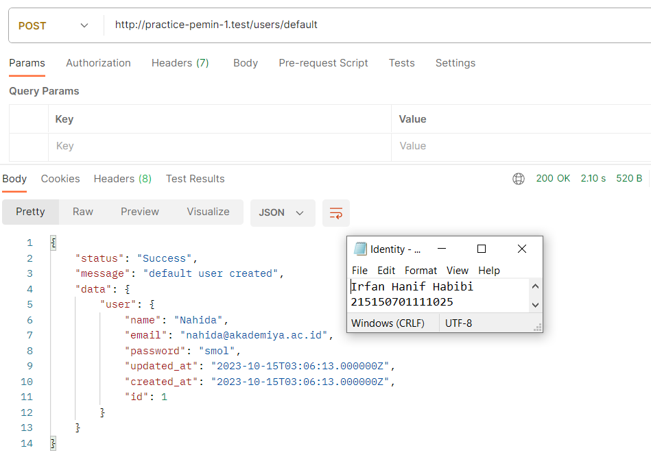

Menjalankan aplikasi lumen dengan rute `/users/new` pada postman.
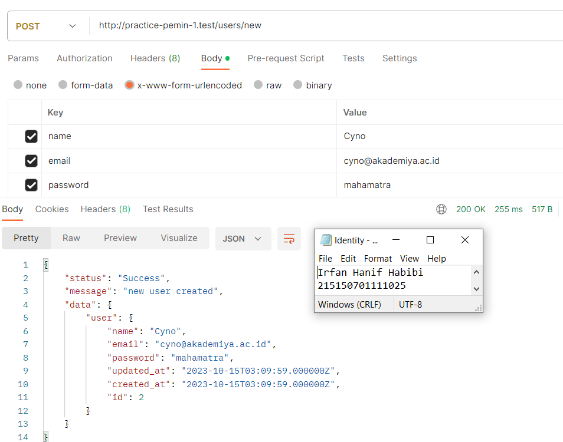

Menjalankan aplikasi lumen dengan rute `/users/all` pada postman.
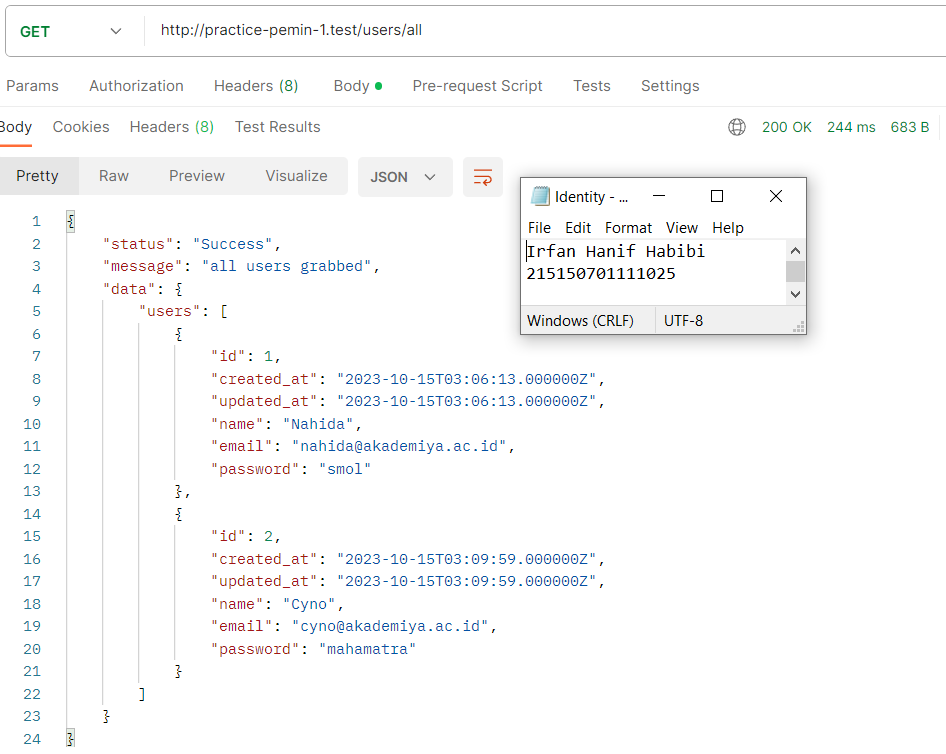


