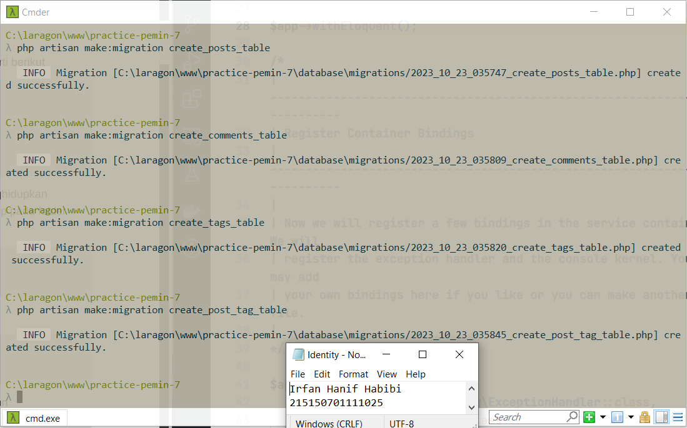
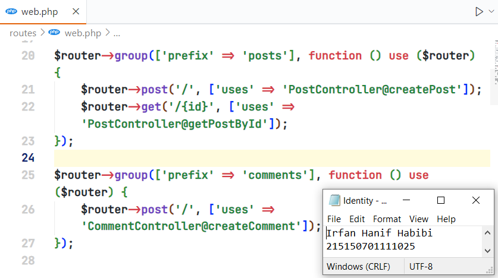

# Modul 7 (Relasi One-to-Many dan Many-to-Many)

Nama: Irfan Hanif Habibi <br>
NIM: 215150701111025

## Pembuatan Tabel

Memastikan server database telah aktif dan sudah membuat database `lumenpost` :


Mengubah konfigurasi database dalam file `.env` menjadi seperti berikut:

```
DB_CONNECTION=mysql
DB_HOST=127.0.0.1
DB_PORT=3306
DB_DATABASE=lumenpost
DB_USERNAME=root
DB_PASSWORD=
```


Mengaktifkan kembali beberapa library bawaan di dalam file dengan direktori `/bootstrap/app.php` dengan mengubah kodenya menjadi berikut:

```
$app->withFacades();

$app->withEloquent();
```


Setelah library diaktifkan, dapat dilakukan pembuatan file-file migration dengan command berikut:

```
php artisan make:migration create_posts_table
php artisan make:migration create_comments_table
php artisan make:migration create_tags_table
php artisan make:migration create_post_tag_table
```



Mengubah fungsi `up()` pada file migrasi `create_posts_table` dengan kode berikut:

```
...

public function up()
    {
        Schema::create('posts', function (Blueprint $table) {
            $table->id();
            $table->timestamps();
            $table->string('content');
        });
    }

...
```


Mengubah fungsi `up()` pada file migrasi `create_comments_table` dengan kode berikut:

```
...

public function up()
    {
        Schema::create('comments', function (Blueprint $table) {
            $table->id();
            $table->timestamps();
            $table->string('review');
            $table->foreignId('postId')->unsigned();
        });
    }

...
```


Mengubah fungsi `up()` pada file migrasi `create_tags_table` dengan kode berikut:

```
...

public function up()
    {
        Schema::create('tags', function (Blueprint $table) {
            $table->id();
            $table->timestamps();
            $table->string('name');
        });
    }

...
```


Mengubah fungsi `up()` pada file migrasi `create_post_tag_table` dengan kode berikut:

```
...

public function up()
    {
        Schema::create('post_tag', function (Blueprint $table) {
            $table->id();
            $table->timestamps();
            $table->foreignId('postId')->unsigned();
            $table->foreignId('tagId')->unsigned();
        });
    }

...
```


Setelah mengubah file-file migration sebelumnya, jalankan command `php artisan migrate`


## Pembuatan Model

Pembuatan file `Post.php` di `app/Models/` dengan mengubah kode didalamnya seperti berikut:

```
<?php

namespace App\Models;

use Illuminate\Database\Eloquent\Model;

class Post extends Model
{
    /**
     * The attributes that are mass assignable.
     *
     * @var string[]
     */
    protected $fillable = [
        'content'
    ];
    /**
     * The attributes excluded from the model's JSON form.
     *
     * @var string[]
     */
    protected $hidden = [];
}
```


Pembuatan file `Comment.php` di `app/Models/` dengan mengubah kode didalamnya seperti berikut:

```
<?php

namespace App\Models;

use Illuminate\Database\Eloquent\Model;

class Comment extends Model
{
    /**
     * The attributes that are mass assignable.
     *
     * @var string[]
     */
    protected $fillable = [
        'review'
    ];
   
    /**
     * The attributes excluded from the model's JSON form.
     *
     * @var string[]
     */
    protected $hidden = [];
}
```


Pembuatan file `Tag.php` di `app/Models/` dengan mengubah kode didalamnya seperti berikut:

```
<?php

namespace App\Models;

use Illuminate\Database\Eloquent\Model;

class Tag extends Model
{
    /**
     * The attributes that are mass assignable.
     *
     * @var string[]
     */
    protected $fillable = [
        'name'
    ];
   
    /**
     * The attributes excluded from the model's JSON form.
     *
     * @var string[]
     */
    protected $hidden = [];
}
```


## Relasi One-to-Many

Setelah menambahkan model-modelnya, kita bisa menambahkan fungsi relasi.

Menambahkan fungsi `comments()` pada file `Post.php` dengan kode berikut ini:

```
...

	public function comments()
	{
		return $this->hasMany(Comment::class, 'postId');
	}
} 
```


Menambahkan fungsi `post()` dan atribut `postId` pada `$fillable` di file `Comment.php` dengan kode berikut ini:

```
...

protected $fillable = [
        'review',
        'postId'
    ];
    /**
     * The attributes excluded from the model's JSON form.
     *
     * @var string[]
     */
    protected $hidden = [];
   
    public function post()
    {
        return $this->belongsTo(Post::class, 'postId');
    }
} 
```


Setelah menambahkan fungsi-fungsi relasi, perlu menambahkan kontroller untuk masing-masing model.

Pembuatan file `PostController.php` pada `app/Http/Controllers` dan menambahkan kode berikut:

```
<?php

namespace App\Http\Controllers;

use App\Models\Post;
use Illuminate\Http\Request;

class PostController extends Controller
{
    /**
     * Create a new controller instance.
     *
     * @return void
     */
    public function __construct()
    {
        //
    }
    //
    public function createPost(Request $request)
    {
        $post = Post::create([
            'content' => $request->content,
        ]);
        return response()->json([
            'success' => true,
            'message' => 'New post created',
            'data' => [
                'post' => $post
            ]
        ]);
    }
    public function getPostById(Request $request)
    {
        $post = Post::find($request->id);
        return response()->json([
            'success' => true,
            'message' => 'All post grabbed',
            'data' => [
                'post' => [
                    'id' => $post->id,
                    'content' => $post->content,
                    'comments' => $post->comments,
                    'tags' => $post->tags
                ]
            ]
        ]);
    }
}
```


Pembuatan file`CommentController.php` pada `app/Http/Controllers` dan menambahkan kode berikut:

```
<?php

namespace App\Http\Controllers;

use App\Models\Post;
use Illuminate\Http\Request;

class CommentController extends Controller
{
    /**
     * Create a new controller instance.
     *
     * @return void
     */
    public function __construct()
    {
        //
    }
    //
    public function createComment(Request $request)
    {
        $comment = Comment::create([
            'review' => $request->review,
            'postId' => $request->postId,
        ]);
        return response()->json([
            'success' => true,
            'message' => 'New comment created',
            'data' => [
                'comment' => $comment
            ]
        ]);
    }
}
```


Penambahan rute untuk fungsi-fungsi dalam kontroller yang telah kita buat dengan menambahkan kode berikut ini pada `routes/web.php`

```
$router->group(['prefix' => 'posts'], function () use ($router) {
    $router->post('/', ['uses' => 'PostController@createPost']);
    $router->get('/{id}', ['uses' => 'PostController@getPostById']);
    $router->put('/{id}/tag/{tagId}', ['uses'=> 'PostController@addTag']);
});

$router->group(['prefix' => 'comments'], function () use ($router) {
    $router->post('/', ['uses' => 'CommentController@createComment']);
});
```



Pembuatan satu post baru dengan Postman.


Pembuatan satu comment baru dengan Postman.


Menampilkan post dengan Postman.


## Relasi Many-to-Many

Menambahkan fungsi `tags()` pada file `Post.php` dengan kode berikut ini:

```
...

public function tags()
    {
        return $this->belongsToMany(Tag::class, 'post_tag', 'postId', 'tagId');
    }
   
```


Menambahkan fungsi `posts()` pada file `Tag.php` dengan kode berikut ini:

```
...

public function posts()
    {
        return $this->belongsToMany(Post::class, 'post_tag', 'tagId', 'postId');
    }
   
```


Pembuatan file`TagController.php` pada `app/Http/Controllers` dan menambahkan kode berikut:

```
<?php

namespace App\Http\Controllers;

use App\Models\Post;
use Illuminate\Http\Request;

class TagController extends Controller
{
    /**
     * Create a new controller instance.
     *
     * @return void
     */
    public function __construct()
    {
        //
    }
    //
    public function createTag(Request $request)
    {
        $tag = Tag::create([
            'name' => $request->name
        ]);
        return response()->json([
            'success' => true,
            'message' => 'New tag created',
            'data' => [
                'tag' => $tag
            ]
        ]);
    }
}
```


Menambahkan fungsi `addTag()` dan response tags pada file `PostController.php` dengan kode berikut ini:

```
...

public function addTag(Request $request)
    {
        $post = Post::find($request->id);
        $post->tags()->attach($request->tagId);
        return response()->json([
            'success' => true,
            'message' => 'Tag added to post',
        ]);
    }
}
```


Menambahkan kode rute berikut pada file `web.php`:

```
$router->group(['prefix' => 'posts'], function () use ($router) {
    $router->post('/', ['uses' => 'PostController@createPost']);
    $router->get('/{id}', ['uses' => 'PostController@getPostById']);
    $router->put('/{id}/tag/{tagId}', ['uses'=> 'PostController@addTag']);
});

...

$router->group(['prefix' => 'tags'], function () use ($router) {
    $router->post('/', ['uses' => 'TagController@createTag']);
});
```


Pembuatan satu tag baru "Jadul" dengan Postman.


Menambahkan tag "Jadul" pada post "disana engkau berdua" dengan Postman.


Menampilkan post "disana engkau berdua" dengan Postman.


Menmbuat post "tanpamu apa artinya" dengan Postman.


Menambahkan tag "Jadul" pada post "tanpamu apa artinya" dengan Postman.


Pembuatan satu tag baru "lagu" dengan Postman.


Pembuatan satu tag baru "lagu" dengan Postman.


Menambahkan tag "lagu" pada post "tanpamu apa artinya" dengan Postman.


Menampilkan post pertama dengan Postman.


Menampilkan post kedua dengan Postman.

