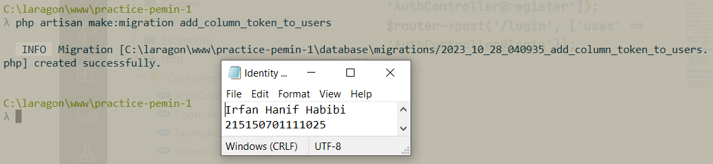

# Modul 8 (Register, Authentication dan Authorization)

Nama: Irfan Hanif Habibi <br>
NIM: 215150701111025

## Register

Memastikan terdapat tabel `users` yang dibuat menggunakan migration pada bab 3 Basic Routing dan Migration :


Memastikan terdapat model `User.php` yang digunakan pada bab 5 Model, Controller dan Request-Response Handler dengan kode berikut:

```
<?php

namespace App\Models;

use Illuminate\Database\Eloquent\Model;

class User extends Model
{
    /**
     * The attributes that are mass assignable.
     *
     * @var array
     */
    protected $fillable = [
        'name', 'email', 'password'
    ];
    /**
     * The attributes excluded from the model's JSON form.
     *
     * @var array
     */
    protected $hidden = [];
}
```


Membuat file `AuthController.php` dengan memiliki kode berikut:

```
<?php

namespace App\Http\Controllers;

use App\Models\User;
use Illuminate\Http\Request;
use Illuminate\Support\Facades\Hash;
use Illuminate\Support\Str;

class AuthController extends Controller
{
    /**
     * Create a new controller instance.
     *
     * @return void
     */
    public function __construct()
    {
        //
    }
    //
    public function register(Request $request)
    {
        $name = $request->name;
        $email = $request->email;
        $password = Hash::make($request->password);
        $user = User::create([
            'name' => $name,
            'email' => $email,
            'password' => $password

        ]);
        return response()->json([
            'status' => 'Success',
            'message' => 'new user created',
            'data' => [
                'user' => $user,
            ]
        ], 200);
    }
}
```


Menambahkan rute baru untuk fungsi `register` yang telah dibuat dengan kode berikut:

```
...
$router->group(['prefix' => 'auth'], function () use ($router) {
    $router->post('/register', ['uses' => 'AuthController@register']);
});
```


Menjalankan aplikasi pada endpoint `/auth/register` dengan body JSON berikut

```
{
	"name": "Scaramouche",
	"email": "scaramouche@fatui.org",
	"password": "wanderer"
}
```


## Authentication

Penambahan fungsi `login(Request $request)` pada file `AuthController.php` dengan kode berikut:

```
<?php

namespace App\Http\Controllers;

use App\Models\User;
use Illuminate\Http\Request;
use Illuminate\Support\Facades\Hash;
use Illuminate\Support\Str;

class AuthController extends Controller
{
	...

    public function login(Request $request)
    {
        $email = $request->email;
        $password = $request->password;
        $user = User::where('email', $email)->first();
        if (!$user) {
            return response()->json([
                'status' => 'Error',
                'message' => 'user not exist',
            ], 404);
        }
        if (!Hash::check($password, $user->password)) {
            return response()->json([
                'status' => 'Error',
                'message' => 'wrong password',
            ], 400);
        }
        return response()->json([
            'status' => 'Success',
            'message' => 'successfully login',
            'data' => [
                'user' => $user,
            ]
        ], 200);
    }
}
```


Menambahkan rute dari fungsi `login` yang telah dibuat dengan kode berikut pada `web.php`:

```
...

$router->group(['prefix' => 'auth'], function () use ($router) {
    $router->post('/register', ['uses' => 'AuthController@register']);
    $router->post('/login', ['uses' => 'AuthController@login']);
});

...
```


Menjalankan aplikasi pada endpoint `/auth/login` dengan body JSON berikut:

```
{
	"email": "scaramouche@fatui.org",
	"password": "wanderer"
}
```


## Token

Menjalankan perintah berikut ini untuk membuat file migrasi baru:

```
php artisan make:migration add_column_token_to_users
```



Mengganti isi file migrasi yang telah dibuat dengan kode berikut:

```
<?php

use Illuminate\Database\Migrations\Migration;
use Illuminate\Database\Schema\Blueprint;
use Illuminate\Support\Facades\Schema;

class AddColumnTokenToUsers extends Migration
{
    /**
     * Run the migrations.
     *
     * @return void
     */
    public function up()
    {
        Schema::table('users', function (Blueprint $table) {
            $table->string('token', 72)->unique()->nullable(); //
        });
    }
    /**
     * Reverse the migrations.
     *
     * @return void
     */
    public function down()
    {
        Schema::table('users', function (Blueprint $table) {
            $table->dropIfExists('token'); //
        });
    }
}

```


Menambahkan `token` dalam atribut `$fillable` dari model `User` dengan baris kode berikut:

```
...

class User extends Model
{
    /**
     * The attributes that are mass assignable.
     *
     * @var array
     */
    protected $fillable = [
        'name', 'email', 'password', 'token'
    ];
    /**
     * The attributes excluded from the model's JSON form.
     *
     * @var array
     */
    protected $hidden = [];
}
```


Menambahkan baris-baris kode berikut dalam fungsi `login` yang telah dibuat sebelumnya:

```
...

public function login(Request $request)
    {
        ...

        $user->token = Str::random(36);
        $user->save();

        return response()->json([
            'status' => 'Success',
            'message' => 'successfully login',
            'data' => [
                'user' => $user,
            ]
        ], 200);
    }
}
```


Menjalankan perintah berikut ini untuk melakukan migrasi terbaru:

```
php artisan migrate
```


Mengetes endpoint `/auth/login` aplikasi yang berjalan dan menyalin token yang dari respon JSON


## Authorization

Membuat file `Authorization.php` pada folder `App/Http/Middleware` dengan menambahkan kode berikut ini:

```
<?php

namespace App\Http\Middleware;

use App\Models\User;
use Closure;
use Illuminate\Http\Request;

class Authorization
{
    /**
     * Handle an incoming request.
     *
     * @param \Illuminate\Http\Request $request
     * @param \Closure $next
     * @return mixed
     */
    public function handle(Request $request, Closure $next)
    {
        $token = $request->header('token') ?? $request->query('token');
        if (!$token) {
            return response()->json([
                'status' => 'Error',
                'message' => 'token not provided',
            ], 400);
        }
        $user = User::where('token', $token)->first();
        if (!$user) {
            return response()->json([
                'status' => 'Error',
                'message' => 'invalid token',
            ], 400);
        }
        $request->user = $user;
        return $next($request);
    }
}
```


Menambahkan middleware `Authorization` yang telah dibuat ke dalam `bootstrap/app.php` dengan mengubah kode berikut ini:

```
...

$app->routeMiddleware([
    'age' => App\Http\Middleware\AgeMiddleware::class,
    'auth' => App\Http\Middleware\Authorization::class,
]);

...
```


Pembuatan fungsi `home` pada `HomeController.php` dengan menambahkan kode berikut:

```
<?php
namespace App\Http\Controllers;

use App\Models\User;
use Illuminate\Http\Request;
use Illuminate\Http\Response;

class HomeController extends Controller
{
    ...

    public function home(Request $request)
    {
        $user = $request->user;
        return response()->json([
            'status' => 'Success',
            'message' => 'selamat datang ' . $user->name,
        ], 200);
    }
}
```


Pembuatan rute untuk fungsi `home` yang telah dibuat yang menggunakan middleware `Authorization` dengan menambahkan kode berikut pada `web.php`:

```
...

$router->get('/home', ['middleware' => 'auth', 'uses' => 'HomeController@home']);

...
```


Mengetes endpoint `/home` aplikasi dengan melampirkan token yang dihasilkan pada login sebelumnya pada header request.

