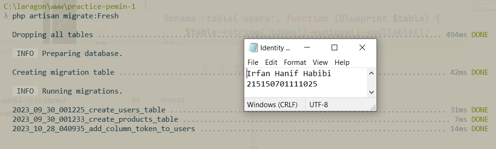
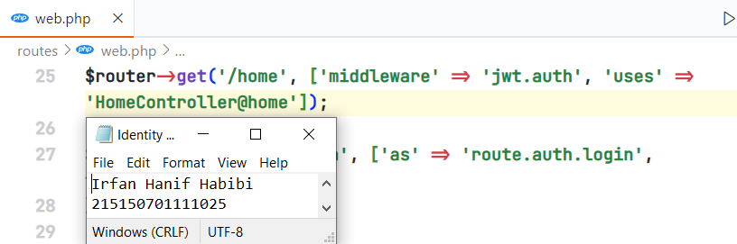

# Modul 9 (JSON Web Token)

Nama: Irfan Hanif Habibi <br>
NIM: 215150701111025

## Penyesuaian Database

Mengubah length kolom token dengan menghapus parameter 72 di belakangnya pada file migrasi seperti kode berikut ini:

```
public function up()
    {
        Schema::table('users', function (Blueprint $table) {
            $table->string('token')->unique()->nullable();
        });
    }
```


Menjalankan migrasi pembaharuan dan menghapus data yang lama dengan perintah berikut:

```
php artisan migrate:fresh
```



Menjalankan aplikasi dengan endpoint `/auth/register` di Postman dengan body JSON berikut:

```
{
	"name": "Scaramouche",
	"email": "scaramouche@fatui.org",
	"password": "wanderer"
}
```


## JWT Manual

Penambahan fungsi `base64url_encode`, `sign`, dan `jwt` pada file `AuthController.php` dengan kode berikut:

```
<?php

namespace App\Http\Controllers;

use App\Models\User;
use Illuminate\Http\Request;
use Illuminate\Support\Facades\Hash;
use Illuminate\Support\Str;

class AuthController extends Controller
{
	...

    private function base64url_encode(String $data): String
    {
        $base64 = base64_encode($data); // ubah json string menjadi base64
        $base64url = strtr($base64, '+/', '-_'); // ubah char '+' -> '-' dan '/' -> '_'
        return rtrim($base64url, '='); // menghilangkan '=' pada akhir string
    }

    private function sign(String $header, String $payload, String $secret): String
    {
        $signature = hash_hmac('sha256', "{$header}.{$payload}", $secret, true);
        $signature_base64url = $this->base64url_encode($signature);
        return $signature_base64url;
    }

    private function jwt(array $header, array $payload, String $secret): String
    {
        $header_json = json_encode($header);
        $payload_json = json_encode($payload);
        $header_base64url = $this->base64url_encode($header_json);
        $payload_base64url = $this->base64url_encode($payload_json);
        $signature_base64url = $this->sign($header_base64url, $payload_base64url, $secret);
        $jwt = "{$header_base64url}.{$payload_base64url}.{$signature_base64url}";
        return $jwt;
    }
}
```


Mengubah fungsi `login` di `AuthController.php`:

```
<?php

namespace App\Http\Controllers;

use App\Models\User;
use Illuminate\Http\Request;
use Illuminate\Support\Facades\Hash;
use Illuminate\Support\Str;

class AuthController extends Controller
{
	...

    public function login(Request $request)
    {
        $email = $request->email;
        $password = $request->password;
        $user = User::where('email', $email)->first();
        if (!$user) {
            return response()->json([
                'status' => 'Error',
                'message' => 'user not exist',
            ], 404);
        }
        if (!Hash::check($password, $user->password)) {
            return response()->json([
                'status' => 'Error',
                'message' => 'wrong password',
            ], 400);
        }
        //
        $jwt = $this->jwt(
            [
                'alg' => 'HS256',
                'typ' => 'JWT'
            ],
            [
                'id' => $user->id,
            ],
            'secret'
        );
        $user->token = $jwt;
        //
        $user->save();
        return response()->json([
            'status' => 'Success',
            'message' => 'successfully login',
            'data' => [
                'user' => $user,
            ]

        ], 200);
    }
}
```


Menambahkan 4 fungsi dalam kode berikut ke dalam `Middleware/Authorization.php`:

```
<?php

namespace App\Http\Middleware;

use App\Models\User;
use Closure;
use Illuminate\Http\Request;

class Authorization
{
    ...

    private function base64url_encode(string $data): string
    {
        $base64 = base64_encode($data);
        $base64url = strtr($base64, '+/', '-_');
        return rtrim($base64url, '=');
    }
    private function base64url_decode(string $base64url): string
    {
        $base64 = strtr($base64url, '-_', '+/');
        $json = base64_decode($base64);
        return $json;
    }
    private function sign(string $header_base64url, string $payload_base64url, string $secret): string
    {
        $signature = hash_hmac('sha256', "{$header_base64url}.{$payload_base64url}", $secret, true);
        $signature_base64url = $this->base64url_encode($signature);
        return $signature_base64url;
    }
    private function verify(string $signature_base64url, string $header_base64url, string $payload_base64url, string $secret): bool
    {
        $signature = $this->base64url_decode($signature_base64url);
        $expected_signature = $this->base64url_decode($this->sign($header_base64url, $payload_base64url, $secret));
        return hash_equals($expected_signature, $signature);
    }
}

```


Mengubah fungsi `handle` dalam `Middleware/Authorization.php` menjadi seperti berikut:

```
<?php

namespace App\Http\Middleware;

use App\Models\User;
use Closure;
use Illuminate\Http\Request;

class Authorization
{
    public function handle(Request $request, Closure $next)
    {
        $token = $request->header('token') ?? $request->query('token');
        if (!$token) {
            return response()->json([
                'status' => 'Error',
                'message' => 'token not provided',
            ], 400);
        }
        //
        [
            $header_base64url,
            $payload_base64url,
            $signature_base64url
        ] = explode('.', $token);
        $header = $this->base64url_decode($header_base64url);
        $json_header = json_decode($header);
        if (!$json_header->alg || $json_header->alg !== 'HS256') {
            return response()->json([
                'status' => 'Error',
                'message' => 'type of token not valid',
            ], 401);
        }
        if (!$json_header->typ || $json_header->typ !== 'JWT') {
            return response()->json([
                'status' => 'Error',
                'message' => 'type of token not valid',
            ], 401);
        }
        $payload = $this->base64url_decode($payload_base64url);
        $json_payload = json_decode($payload);
        if (!$json_payload->id) {
            return response()->json([
                'status' => 'Error',
                'message' => 'invalid token',
            ], 400);;
        }
        $verified = $this->verify($signature_base64url, $header_base64url, $payload_base64url, 'secret');
        if (!$verified) {
            return response()->json([
                'status' => 'Error',
                'message' => 'invalid sign token',
            ], 400);;
        }
        $id = $json_payload->id;
        $user = User::where('id', $id)->first();
        //
        if (!$user) {
            return response()->json([
                'status' => 'Error',
                'message' => 'invalid token',
            ], 400);
        }
        $request->user = $user;
        return $next($request);
    }

	...
}
```


Menjalankan aplikasi dengan endpoint `/auth/login`:


Menjalankan aplikasi dengan endpoint `/home` dengan menyisipkan `token` yang didapatkan dari login dalam header:


## JWT Library

Generate jwt key secara online dengan Djecrety dan menaruh key ke dalam variabel `.env` baru bernama `JWT_SECRET`.


Penginstalan pacakge `jwt` firebase dengan menggunakan perintah berikut:

```
composer require firebase/php-jwt
```


Menambahkan fungsi `jwt` di `AuthController.php` dengan kode berikut:

```
<?php

namespace App\Http\Controllers;

use App\Models\User;
use Illuminate\Http\Request;
use Illuminate\Support\Facades\Hash;
use Illuminate\Support\Str;

use Firebase\JWT\JWT;

class AuthController extends Controller
{
	...

    protected function jwt(User $user)
    {
        $payload = [
            'iss' => 'lumen-jwt', //issuer of the token
            'sub' => $user->id, //subject of the token
            'iat' => time(), //time when JWT was issued.
            'exp' => time() + 60 * 60 //time when JWT will expire
        ];
        return JWT::encode($payload, env('JWT_SECRET'), 'HS256');
    }

	...
}
```


Mengubah fungsi `login` di dalam `AuthController.php` dengan kode berikut:

```
<?php

namespace App\Http\Controllers;

use App\Models\User;
use Illuminate\Http\Request;
use Illuminate\Support\Facades\Hash;
use Illuminate\Support\Str;

use Firebase\JWT\JWT;

class AuthController extends Controller
{
	...

    public function login(Request $request)
    {
        $email = $request->email;
        $password = $request->password;
        $user = User::where('email', $email)->first();
        if (!$user) {
            return response()->json([
                'status' => 'Error',
                'message' => 'user not exist',
            ], 404);
        }
        if (!Hash::check($password, $user->password)) {
            return response()->json([
                'status' => 'Error',
                'message' => 'wrong password',
            ], 400);
        }
        $user->token = $this->jwt($user); //
        $user->save();
        return response()->json([
            'status' => 'Success',
            'message' => 'successfully login',
            'data' => [
                'user' => $user,
            ]
        ], 200);
    }

	...
}
```


Membuat file `JwtMiddleware.php` dan menambahkan kode berikut:

```
<?php

namespace App\Http\Middleware;

use Closure;
use Exception;
use App\Models\User;
use Firebase\JWT\JWT;
use Firebase\JWT\Key;
use Firebase\JWT\ExpiredException;

class JwtMiddleware
{
    function handle($request, Closure $next, $guard = null)
    {
        $token = $request->header('token') ?? $request->query('token');
        // $token = $request->get('token');
        if (!$token) {
            //Unauthorized response if token not there
            return response()->json([
                'error' => 'Token not provded.'
            ], 401);
        }
        try {
            $credentials =
                JWT::decode($token, new Key(env('JWT_SECRET'), 'HS256'));
        } catch (ExpiredException $e) {
            return response()->json([
                'error' => 'Provided token is expired.'
            ], 400);
        } catch (Exception $e) {
            return response()->json([
                'error' => 'An error while decoding token.'
            ], 400);
        }
        $user = User::find($credentials->sub);
        $request->user = $user;
        return $next($request);
    }
}

```


Menambahkan middleware `JwtMiddleware.php` ke dalam rute middleware di `bootstrap/app.php` sesuai dengan baris kode berikut:

```
$app->routeMiddleware([
    ...

    'jwt.auth' => App\Http\Middleware\JwtMiddleware::class,
]);
```


Menambahkan baris kode rute berikut ke dalam `web.php`:

```
$router->get('/home', ['middleware' => 'jwt.auth', 'uses' => 'HomeController@home']);
```



Menjalankan aplikasi dengan endpoint `/auth/login` dengan body JSON berikut dalam Postman:

```
{
	"email": "scaramouche@fatui.org",
	"password": "wanderer"
}
```


Menjalankan aplikasi dengan endpoint `/home` dengan menyisipkan `token` yang didapatkan dari login dalam header:

